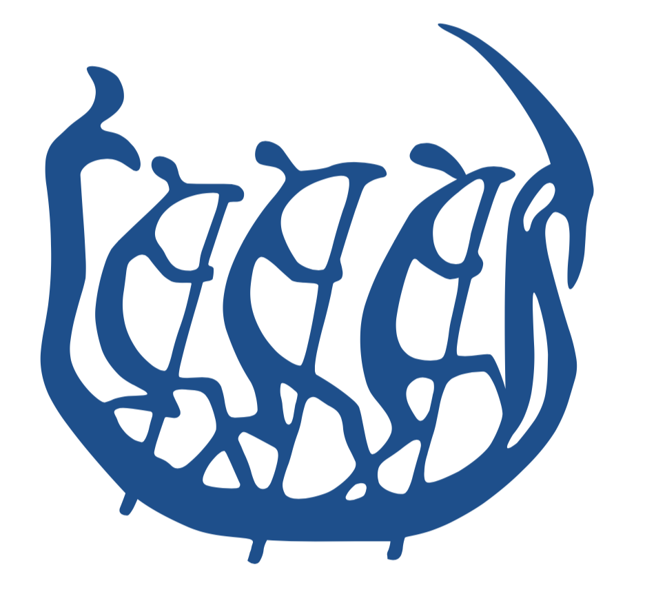
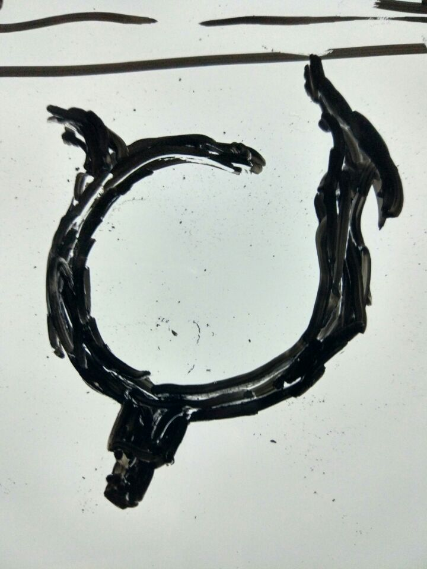
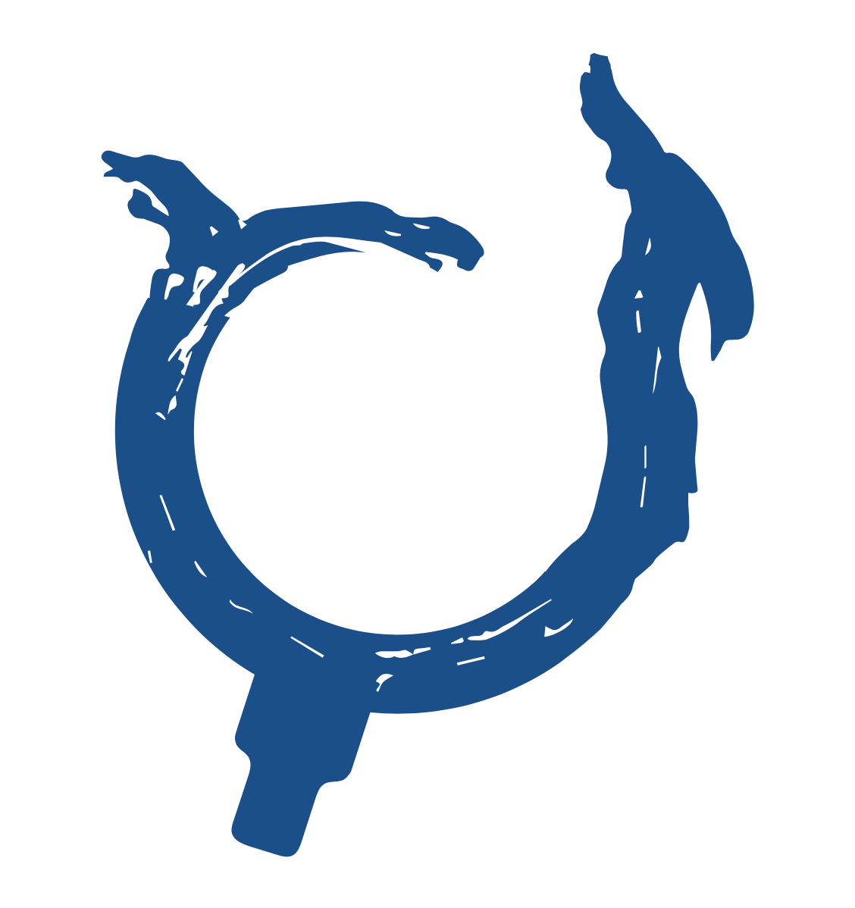
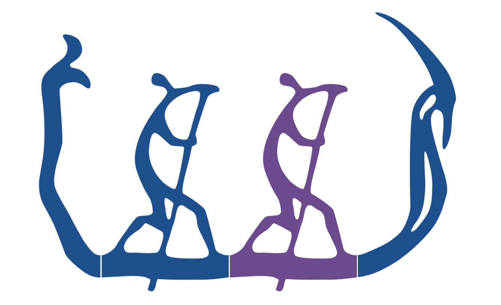
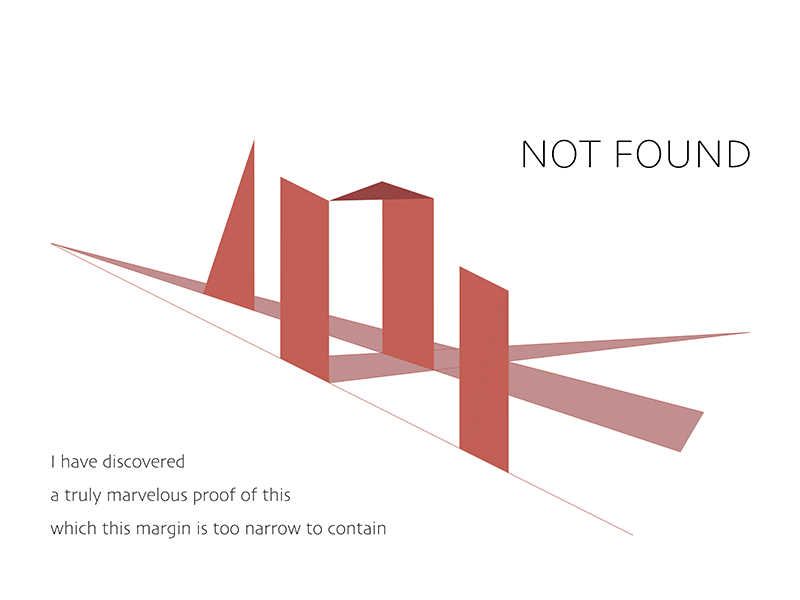
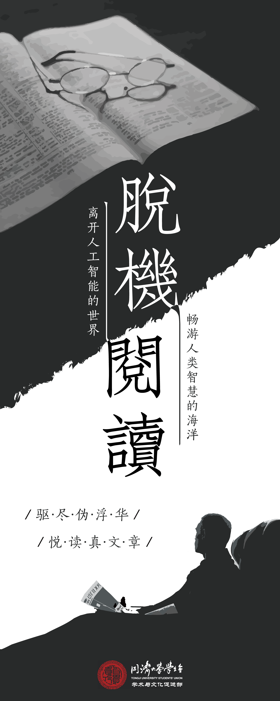
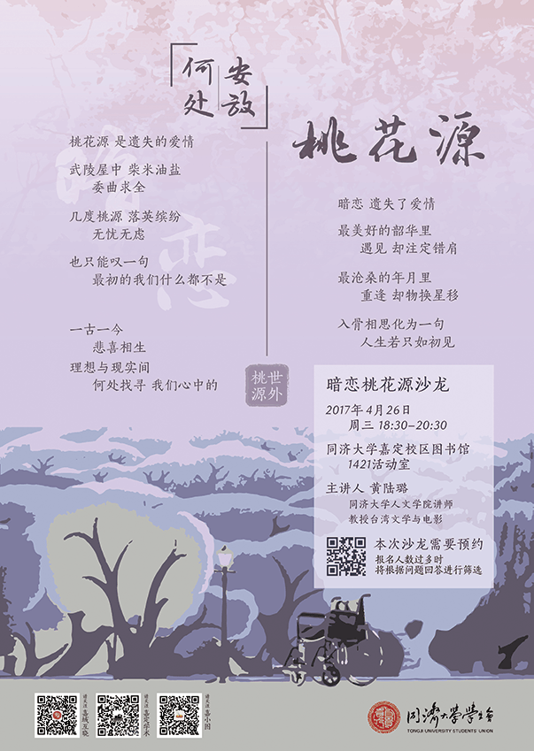
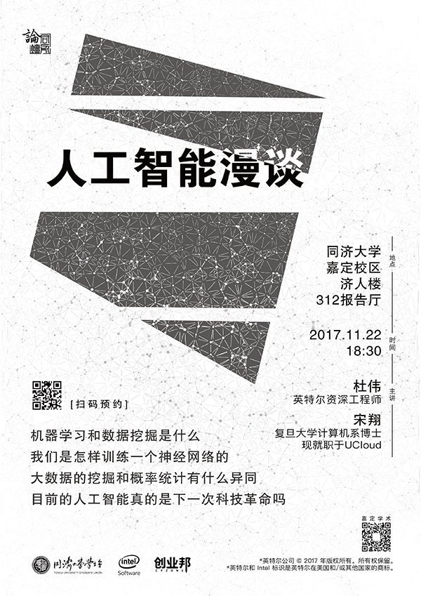
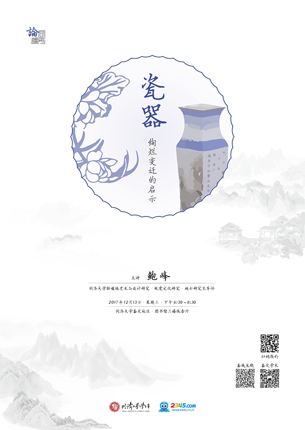
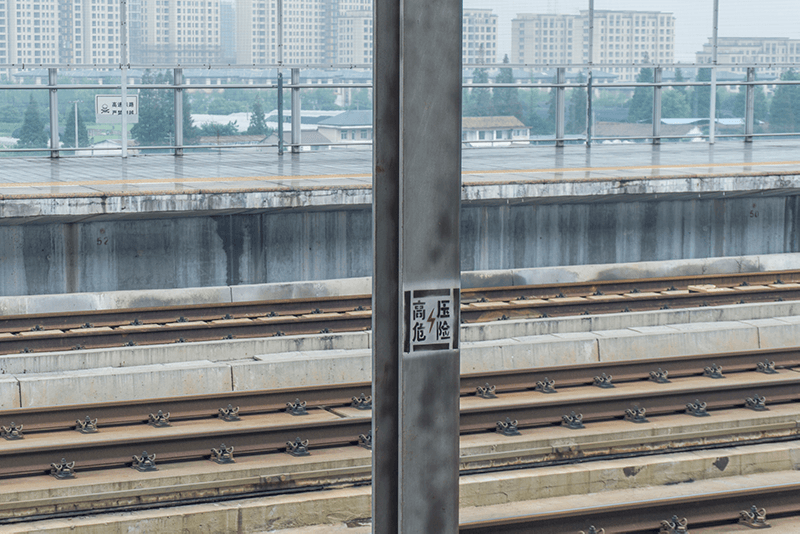

从前对设计没有概念，觉得自己没有绘画基础就做不成事。但是需求不等人，又找不到合适的美工，一来二去自己反而上路了。历史的进程真是神奇。

## 网页设计

### 初探 · 搜索

第一次做网站设计是在两年以前，当时学校某机构打算做一个搜索引擎。本来只是发呆，随手涂了一个 Logo 出来，忽然就有了灵感，干脆整个网站的页面设计都自己做。网站布局同谷歌无二，但有些细节值得一提。

网站为同济内部的搜索引擎。根据搜索引擎的功能，从搜索动作中抽离出放大镜的元素；在草图的基础上，从同济校徽中抽离出龙舟的元素。因为同济师生为网站主要用户，同济龙舟元素在 Logo 中的化用可以增强使用者的内心认同。

在百度、谷歌等等搜索引擎的页面设计中，页码部分都有自己的元素，如百度用熊脚印表示分页页码，谷歌用 G**oo**gle 中多个不同颜色的字母 **o** 表示。既然如此，同济校徽中有三个并排划船的人，这恰好构成了分页的重要素材。只需将同济校徽稍作变形拆分，即可用来表示分页。

后来项目因故搁置，但这套设计我一直留着。

### TJMOOC · 404页面

TJMOOC 是一个数学慕课网站，设计、前端都由我独立完成。404 页面对网站功能性没有影响，却是用户与网站交互过程中不可缺少的一环。

404 来源于 HTTP 请求中的 404 状态码，表示服务器无法找到文件。但在网络亚文化发展过程中，404 被从其他状态码中提升出来，成为一个单独的意向，并被赋予多重内涵。它可以代表无法找寻的迷茫，代表计划之外的错误；象征着某种迷思，甚至成为暗流涌动的政治隐喻。

沿着内涵放射思考，我们可以联想到类似意向如巨石阵、潘洛斯三角形，从中提取出抽象几何图形，通过平行排布与视觉错觉，表现错误、迷茫的感受。

页面字体选择无衬线字体，融入几何感，干净利落。左下角的话来自费马对费马大定理的证明：“我有一个对这个命题的十分美妙的证明，可惜空白太小，我写不下。”

BTW，我把它放到 [Dribbble](https://dribbble.com/softech86) 上面去了。Dribbble 居然禁止 iframe 嵌入页面。点击预览下面`在新页面查看`按钮看吧~

## 学生会的海报

大二时加入校学生会，机缘巧合进入负责宣传的部门。日常任务即包括活动海报、易拉宝、传单之类宣传品，每张宣传品主题应与活动契合。

### 脱机阅读

在这些原则的指导下，我为脱机阅读活动设计了易拉宝。脱机阅读活动旨在让同学们抽出一段时间，远离手机等等电子设备，贴近纸质书籍，以传统的方式阅读文章。

因为活动内容为阅读，我特意选用了书本、眼镜、墨迹、阅读者这几个意向；在字体的选取上，使用书法痕迹明显的楷书，并对引导线做书法笔画处理；在颜色的选取上，选用传统中国色中的墨色。由此，我希望观众在观看海报的过程中，通过这些意向唤醒儿时对书画的记忆，产生参与阅读活动的欲望。

### 暗恋桃花源

本次活动为话剧《暗恋桃花源》的沙龙，需要海报用作宣传，吸引有兴趣的同学了解这个话剧，参与到沙龙的讨论中。

由于主题是一场话剧，海报的设计中应当适当突出传统元素。海报中运用两种不同的字体：海报文案和活动信息使用可读性较好的木刻宋体，海报标题使用极具张力的行书，增强整张海报的文化氛围。作为点缀的木刻元素和印章元素，也同字体的风格相互照应。

海报的背景化用了话剧的一个场景。这个场景中，桃花林与轮椅作为话剧中两个剧中剧的部分摆放在一起，体现了两部分剧情和精神的对立与融合。

设计海报时，需要加入三个公众号二维码和一个活动二维码；二维码的形状与主题毫无关联。这张海报中，公众号的二维码被放置于页面左下角舞台留白位置，预约二维码与活动信息作为整体浮动于话剧场景上方，在不使用异形二维码的情况下，这样的做法既将二维码合理安排，明显易扫，又不割裂画面和意向，从而兼顾信息展示和氛围渲染。

现在看这张海报，印章、分割线以及半透明桃花的装饰痕迹过重，甚至有些喧宾夺主，反而影响了主题表达以及观众对信息的接收。

### 人工智能

这是给人工智能讲座设计的黑白传单。作为传单，传递的信息（活动信息及文案）应当首要清晰、一目了然。受限于打印设备和打印效果，整个海报应简洁、高对比。本次活动海报先于传单，字体和元素已给定，设计风格应保持统一。

将人工智能的缩写 **AI** 变形为几何图形，简练、具有未来感。相互连接的网络寓意机器学习中相互联结的神经元，以此作为背景，可以丰富画面内容，增添细节。

### 瓷器

这个活动以后再写。贴个海报~

有个小彩蛋：本来想用主色给赞助商的 logo 重新上色的，后来审核的时候被驳回了，说赞助商 logo 一点都不能改。只好硬着头皮把那个五颜六色的 logo 放上去，不过还是适当调整了 logo 的大小和对比度。这也算是设计跟世俗的一点妥协吧。

## 设计原则

为了提高能力，我专门找了些设计方面的书籍来读，尤其了解了一下`设计原则`。

>设计<del>模式</del>原则
- 单一职责原则
- 里氏代换原则
- 依赖倒置原则
- 接口隔离原则
- 迪米特法则
- 开闭原则

emmm...上面是设计模式原则，对不起对不起。

重来重来！

>设计原则
- 对比
- 重复
- 对齐
- 亲密性

所谓大道至简，就是这个道理。看起来不舒服的设计，通常都可以认为违反了部分原则。

在这里安利一下`《写给大家看的设计书》`，设计入门佳作。这本书中例子很好印证了上面的原则。多加练习，对设计会有许多新体会。

## 摄影

国庆假期去重庆。不由得感叹重庆真是一个层次丰富的城市。站在长江边，对岸像高维度展开的画。

有时候会被街头巷尾的故事感动到。有人在学画，有人在生活。
